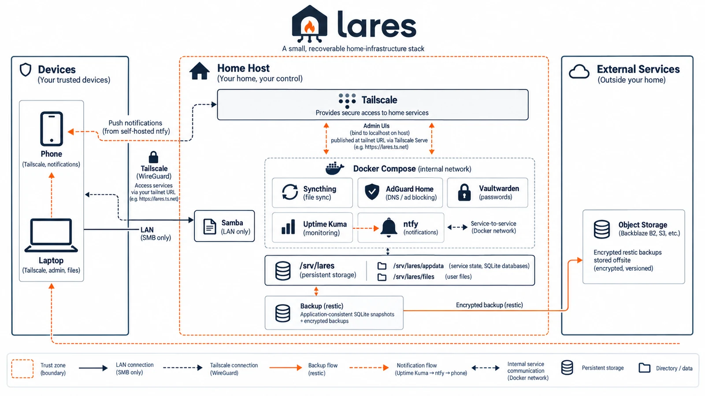
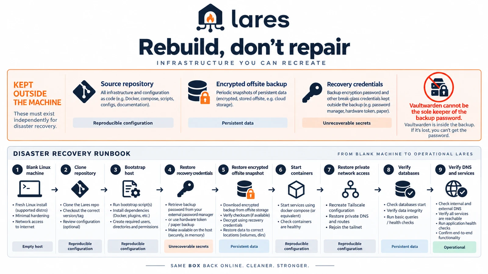

<div align="center">


# Lares

### Boring, recoverable infrastructure for the home.

A small self-hosted stack built around failure semantics and reconstruction,
rather than around collecting applications.

[](https://github.com/AndreaBozzo/lares/actions/workflows/validate.yml)


[](LICENSE)

</div>

<br>

> **Lares assumes the machine will eventually die.**

That single assumption drives everything here. State is backed up
application-consistently and offsite. Images are pinned by digest. Resource
ceilings are enforced by the kernel rather than declared and ignored.
Administrative interfaces never touch the LAN. And rebuilding the host from a
blank disk is a scripted, documented path instead of an afternoon of
remembering.

<br>

<div align="center">

</div>

<br>

## What happens when…

Most self-hosted stacks answer "what does it run". This one answers what it does
when things go wrong — which is the part you actually live with.

| Failure | Response |
| :--- | :--- |
| 💀 **the disk dies** | Scripted bare-metal reconstruction: `bootstrap.sh` → `restore.sh` → `compose up`. See [disaster recovery](docs/disaster-recovery.md). |
| 🗃️ **a database is mid-write during backup** | Snapshots taken *through* SQLite with locks held, verified with `integrity_check`, promoted atomically. A failed vault snapshot **fails the job** rather than shipping stale data. |
| 📦 **an image changes under you** | Every image pinned by digest. Upgrades are deliberate, never a side effect of `compose up`. |
| 🔌 **the host disappears** | Clients fall back to a second nameserver. Password clients keep working offline from their encrypted local cache. |
| 🤫 **the backup quietly stops running** | A push monitor with a 25-hour heartbeat notices, and pushes to your phone. |
| 🧠 **you restore onto a tmpfs** | `restore.sh` refuses, after checking the target filesystem and free space. |
| 📉 **the machine only has 4 GB** | Memory ceilings enforced — plus a check that the kernel is *actually* enforcing them. |
| 🔕 **another workload needs a quiet machine** | `stack.sh quiesce` stops the service layer and reports what still draws power. |

Several of these exist because they went wrong first. The tmpfs guard was
written after a test restore consumed system RAM on the machine serving DNS to
the house.

<br>

## Rebuild, don't repair

<div align="center">

</div>

Three things must live **outside** the machine, or recovery is impossible:

| | |
| :--- | :--- |
| 📁 **This repository** | reproducible configuration |
| 🔒 **The encrypted offsite backup** | persistent data |
| 🔑 **The recovery credentials** | unrecoverable secrets |

That last one carries a trap worth stating plainly:

> **Vaultwarden cannot be the sole keeper of the backup password**, because
> Vaultwarden is *inside* the backup. You would need the password to restore the
> vault that holds the password.

Keep it on paper, or somewhere reachable from a phone while the house is on fire.

<br>

## What's in it

| Service | Role | Exposure |
| :--- | :--- | :--- |
| **AdGuard Home** | network DNS + ad blocking | DNS on the LAN · UI localhost only |
| **Syncthing** | continuous file and photo sync | localhost only |
| **Vaultwarden** | password manager | localhost only |
| **Uptime Kuma** | monitoring | localhost only |
| **ntfy** | push notifications to your phone | localhost only |
| **Samba** | SMB file share | LAN, one interface, SMB3 |
| **Tailscale** | private access to all of the above | — |
| **restic** | encrypted offsite backup | outbound |

Every web UI binds to `127.0.0.1` and is published **only** through
`tailscale serve`, with real certificates and tailnet-only reachability. Nothing
administrative is ever exposed on the LAN.

<br>

## Getting started

```sh
git clone https://github.com/AndreaBozzo/lares.git && cd lares
cp .env.example .env && $EDITOR .env    # identity, storage, network
sudo ./scripts/bootstrap.sh --check     # report what it would do, change nothing
sudo ./scripts/bootstrap.sh             # provision the host
sudo tailscale up --accept-dns=false
docker compose up -d
sudo ./scripts/verify.sh                # prove it actually works
```

`bootstrap.sh` is idempotent, and states plainly what it *cannot* automate —
interactive logins, account creation, anything needing a browser. It does not
pretend those are done.

`verify.sh` checks behaviour rather than configuration: the kernel's
`memory.max` rather than compose's `mem_limit`, a genuinely filtered DNS answer
rather than a container being up, snapshot age rather than a timer existing. It
exits with the failure count, so a monitor can run it.

<br>

## Requirements and assumptions

**Tested on Raspberry Pi OS 64-bit**, on a 4 GB Pi 5. Designed for Debian-like,
systemd-based hosts: `bootstrap.sh` uses `apt-get`, `systemctl`, and Raspberry
Pi's `/boot/firmware/cmdline.txt` to enable the memory cgroup. The design
generalises; the bootstrap script does not yet.

It also assumes a **home host behind NAT**. AdGuard publishes port 53 on every
host interface, and Samba binds a LAN interface — do not put this on an
internet-facing VM without changing both.

`/srv/lares` is a documented **invariant**, not a setting. The diagrams, docs
and backup include-list all assume it.

<br>

## Design rules

**Verify at the kernel, not in the config.**
Raspberry Pi OS ships with the memory cgroup disabled, so Docker accepts
`mem_limit` and silently discards it while `docker inspect` reports `Memory=0`.
A limit you have not confirmed is a comment.

**Internal traffic uses internal names.**
Tailnet MagicDNS names are not publicly resolvable, and containers cannot
resolve them. Service-to-service URLs use Docker service names. Getting this
wrong yields a notification channel that reaches nobody, and looks fine until
you need it.

**Prefer structural boundaries to rules.**
Service state sits outside the SMB share's path, rather than being hidden by an
exclusion directive a later edit could drop.

**Derive what is knowable.**
A setting that can disagree with reality is worse than no setting, especially
when it is only consulted on the failure path.

**A guard that has never failed is not a guard.**
Every failure path here has been triggered deliberately at least once.

<br>

## Documentation

- **[Disaster recovery](docs/disaster-recovery.md)** — the full path from blank disk to running host

<br>

---

<div align="center">
<sub>MIT licensed · <i>Lares</i> were the Roman guardians of the household</sub>
</div>
